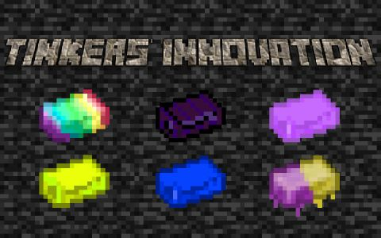

</a>
# Tinkers-Innovation

# LANGUAGE 
### [简体中文](readme/README(zh_cn).md) 
# Mod Introduction
This is an additional mod for tconstruct. It add various of materials,modifiers and tools.
For example:
# Materials
polychrome alloy: This is a material that can enhance other fourth level materials.
# Modifiers
This mod add some modifiers from enchantments of Apotheosis and L2 Complements.
# Tools
heavy shield: This shield can both block and attack.
And more...